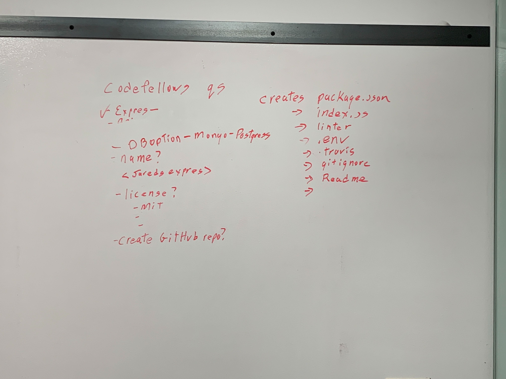
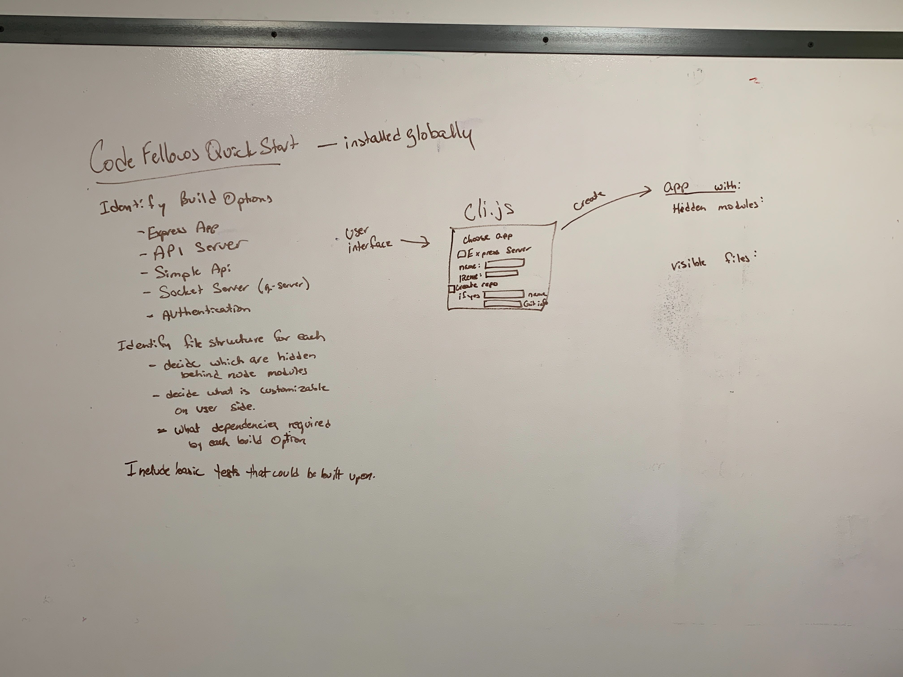

 401d28 Midterm
=================================================

## Code Fellows Quick Start npm Macro

### Author: Becca Lee, Jared Pattison, Tanner Seramur, and Ryan Gallaway

### Links and Resources
* [repo](https://github.com/TannerSeramur/401-midterm)
* [travis](http://xyz.com)
* [back-end](http://xyz.com) (when applicable)
* [front-end](http://xyz.com) (when applicable)

#### Documentation
* [swagger](http://xyz.com) (API assignments only)
* [jsdoc](http://xyz.com) (All assignments)

### Modules
#### `modulename.js`
##### Exported Values and Methods

###### `foo(thing) -> string`
Usage Notes or examples

###### `bar(array) -> array`
Usage Notes or examples

### Setup
#### `.env` requirements
* `PORT` - Port Number
* `MONGODB_URI` - URL to the running mongo instance/db

#### Running the app
* `npm i` to install dependenices
* `node index.js` to run app
* follow instructions to build app
* Endpoint: `/foo/bar/`
  * Returns a JSON object with abc in it.
* Endpoint: `/bing/zing/`
  * Returns a JSON object with xyz in it.
  
#### Tests
* `npm test` to run tests 
* How do you run tests?
* What assertions were made?  <!-- To Be Determined -->
* What assertions need to be / should be made? <!-- To Be Determined -->

#### UML

